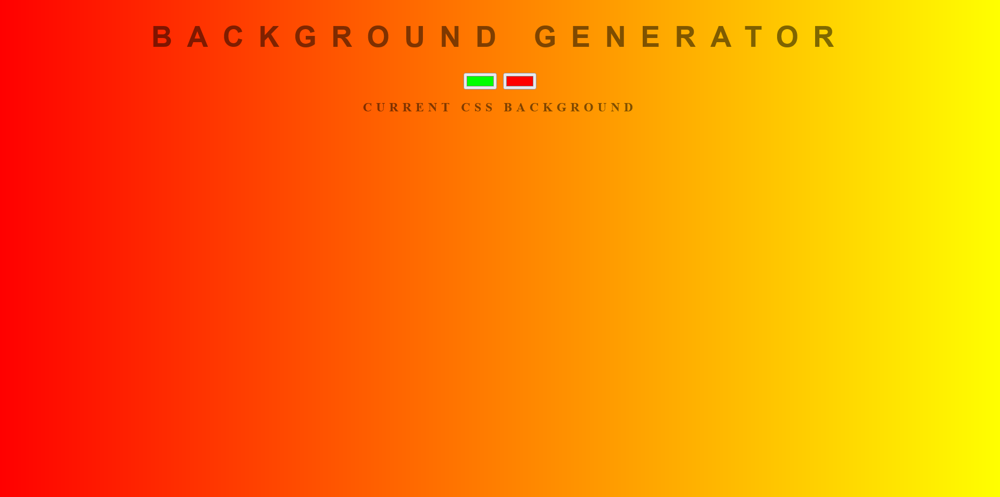

# Background Generator

A simple web-based gradient background generator where users can select two colors to create a linear gradient. The project dynamically updates the background in real-time and displays the corresponding CSS code. This project is part of the Complete Web Developer course by Zero To Mastery, showcasing fundamental JavaScript and DOM manipulation skills.

## Table of contents

- [Background Generator](#background-generator)
  - [Table of contents](#table-of-contents)
  - [Overview](#overview)
    - [Screenshot](#screenshot)
    - [Links](#links)
    - [Built with](#built-with)
    - [What I learned](#what-i-learned)
    - [Continued development](#continued-development)
    - [Useful resources](#useful-resources)
  - [Author](#author)
  - [Acknowledgments](#acknowledgments)

## Overview

The Background Generator allows users to:
- Choose two colors using color pickers.
- Generate a linear gradient background between the selected colors.
- Copy the CSS code for use in their own projects.

### Screenshot



### Links

- Solution URL: [GitHub Repository](https://github.com/dantvi/background-generator)
- Live Site URL: [DT Code](https://background-generator.dtcode.se/)

### Built with

- HTML5:
  - Semantic elements for structure.
- CSS3:
  - Linear gradients to create the dynamic backgrounds.
  - Typography and layout for a clean interface.
- JavaScript (ES6+):
  - Event listeners to update the background in real-time.
  - DOM manipulation for gradient display and CSS code generation.

### What I learned

This project enhanced my understanding of:
- CSS Gradients:
  - Creating and customizing linear gradients.
  - Understanding gradient direction and color stops.
- JavaScript Event Handling:
  - Using addEventListener to dynamically update the UI.
  - Manipulating DOM elements to reflect user interactions.
- Real-time Styling:
  - Updating inline styles to create a seamless user experience.
  - Displaying CSS code dynamically for user reference.

The following code snippet demonstrates how the gradient is applied and the CSS is updated dynamically:

```js
function setGradient() {
  body.style.background =
    "linear-gradient(to right, "
    + color1.value
    + ", "
    + color2.value
    + ")";
  css.textContent = body.style.background + ";";
}

color1.addEventListener("input", setGradient);
color2.addEventListener("input", setGradient);
```

### Continued development

Future improvements may include:
- Adding more gradient types, such as radial gradients.
- Allowing users to select gradient angles.
- Adding a "randomize" button to generate random gradient combinations.

### Useful resources

- [MDN Web Docs: Linear Gradients](https://developer.mozilla.org/en-US/docs/Web/CSS/gradient/linear-gradient) - A great guide on gradient syntax and use cases.
- [MDN Web Docs: DOM Event Listeners](https://developer.mozilla.org/en-US/docs/Web/API/EventTarget/addEventListener) - Helped in understanding event-driven programming.

## Author

- GitHub - [@dantvi](https://github.com/dantvi)
- LinkedIn - [@danieltving](https://www.linkedin.com/in/danieltving/)

## Acknowledgments

Thanks to Zero To Mastery for their comprehensive course and to MDN Web Docs for their excellent resources on web development.
